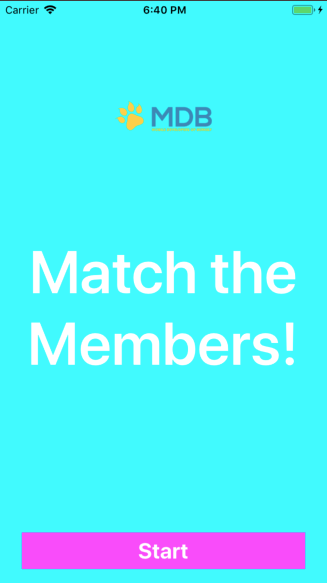
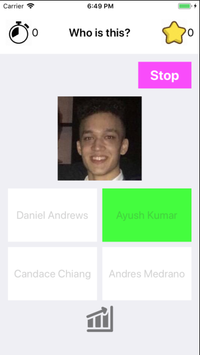

# Match-The-Members
Match the Members is a trivia game challenging users to match names to faces for current (Fall 2019) Mobile Developer of Berkeley (MDB) members. To start, the user to given a random MDB face as well as four name options, one of which is correct. The goal for the user is to try to choose the correct name in five seconds. There is also a statistics screen where users to view their longest streak for correct answers as well as the three most recent results.

